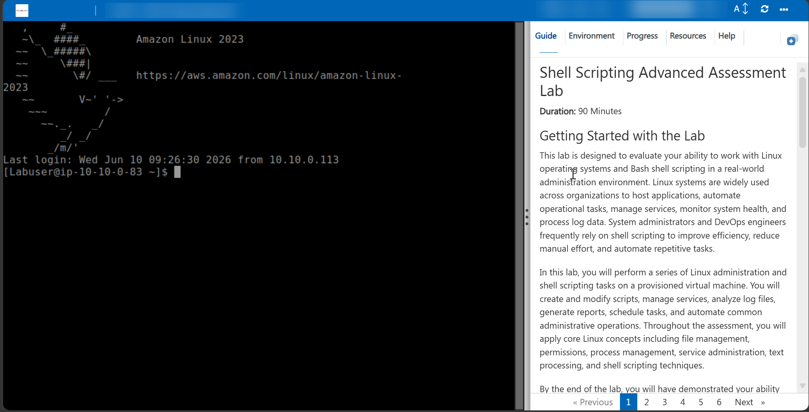
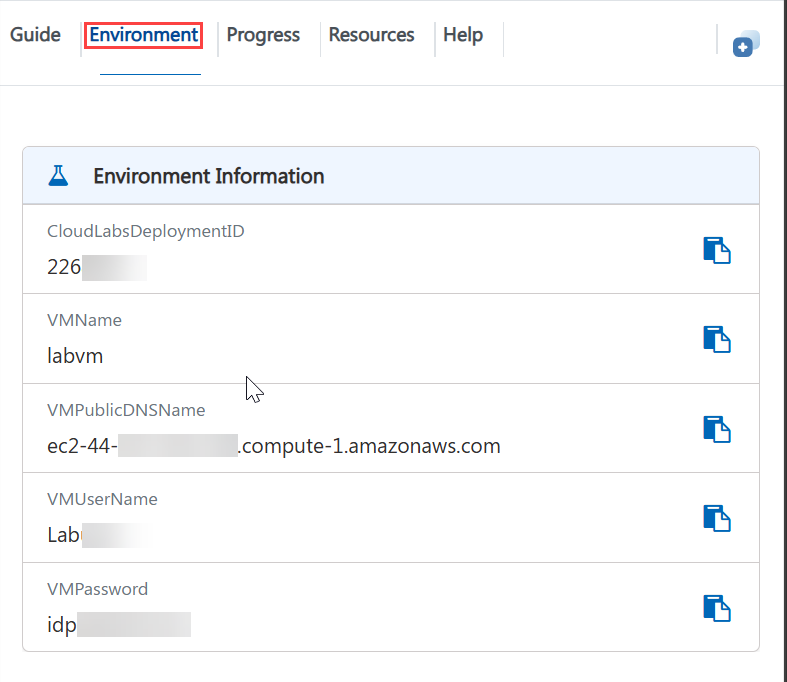
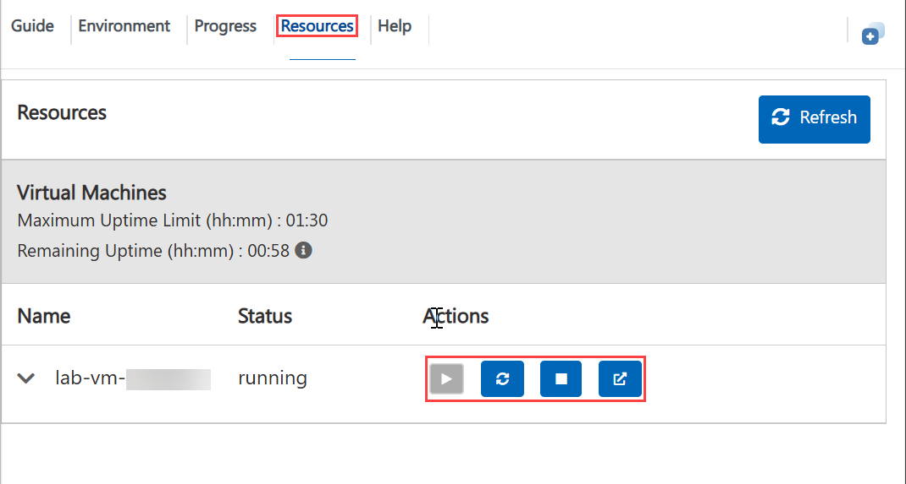
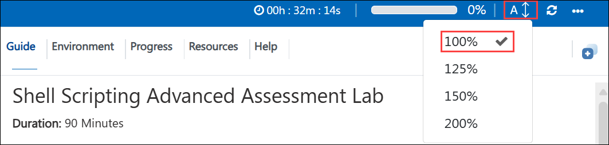
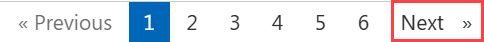

# **Cloud AWS Bash Ansible Windows and Linux Assessment 03**

**Duration: 90 Minutes**

## **Getting Started**

This Assessment is designed to evaluate your ability to work with Linux operating systems and Bash shell scripting in a real-world administration environment. Linux systems are widely used across organizations to host applications, automate operational tasks, manage services, monitor system health, and process log data. System administrators and DevOps engineers frequently rely on shell scripting to improve efficiency, reduce manual effort, and automate repetitive tasks.

In this assessment, you will perform a series of Linux administration and shell scripting tasks on a provisioned virtual machine. You will create and modify scripts, manage services, analyze log files, generate reports, schedule tasks, and automate common administrative operations. Throughout the assessment, you will apply core Linux concepts including file management, permissions, process management, service administration, text processing, and shell scripting techniques.

By the end of the , you will have demonstrated your ability to work effectively in a Linux environment and automate operational tasks using Bash scripting.

---

The assessment uses a split layout: the virtual machine on one side and the guide on the other. Keep both visible so you can read a task and perform it immediately.



Your Deployment ID for this run is **<inject key="CloudLabsDeploymentID" enableCopy="false"/>** - quote it if you contact support.
You can also find it in the **Environment** tab, as shown in the screenshot under **Accessing Your Environment**.

---

# **Environment Detailes**

To view environment information, credentials, and resource details, navigate to the **Environment** tab.



---
# **Utilizing the Split Window Feature**

For convenience, you can open the guide in a separate window by selecting the Split Window button from the Top right corner.


# **Connecting to the Virtual Machine**

You may connect to the Linux virtual machine using SSH.

### **SSH Command**

```bash
ssh <inject key="VMUserName" enableCopy="true"/>@<inject key="VMPublicDNSName" enableCopy="true"/>
```

### **Username**

```text
<inject key="VMUserName" enableCopy="true"/>
```

### **Password**

```text
<inject key="VMPassword" enableCopy="true"/>
```

---

These commands should display your current username and the hostname of the virtual machine.

---

# **Managing Your Virtual Machine**

You may Start, Restart, or Stop your virtual machine at any time using the **Resources** tab available within the environment.



---

# **Guide Zoom In / Zoom Out**

To adjust the zoom level of the environment page, use the zoom controls located next to the session timer.



---

# **Validation**

After completing each task, select the **Validate** button located within the Validation section of the guide.

* If validation succeeds, proceed to the next task.
* If validation fails, carefully review the error message and revisit the task instructions before attempting validation again.


---

# **Support Contact**

The CloudLabs support team is available 24/7 throughout your experience.

### **Learner Support**

**Email Support:** [labs-support@spektrasystems.com](mailto:labs-support@spektrasystems.com)

**Live Chat Support:** https://support.cloudlabs.ai/isv

---

Click **Next** to begin Scenario 1.



## **Happy Assessing !!**

# Testing static & dynamic injeckt key combos

 <inject key="UserName" enableCopy="true" />

        **checkNNumber:** <inject key="UserName" value="StaticValue4" key="UserName" value="StaticValue4" enableCopy="true" />

        **checkNNumber:** <inject key="Password" value="StaticValue2" key="AzureAdUserEmail" value="StaticValue1" enableCopy="false" />

        **checkNNumber:** <inject key="Password" value="StaticValue3" key="UserName" value="StaticValue2" />

        **checkNNumber:** <inject key="UserName" value="StaticValue" key="UserName" value="StaticValue" />

        **url:** <inject key="Password" value="StaticValue2" key="AzureAdUserEmail" value="StaticValue1" enableCopy="false" />
    
