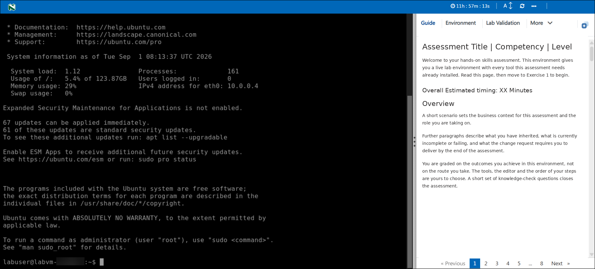
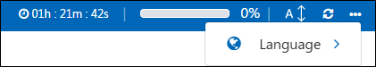
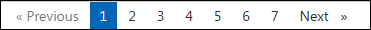
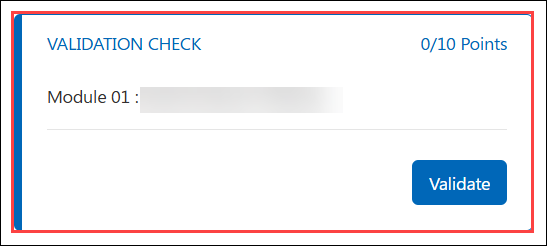

# **Getting Started with Your Assessment Environment**

Welcome. This page explains how the assessment environment works and how to
move around it. Nothing here is specific to the subject you are about to be
assessed on - it applies to every assessment delivered on this platform.

Read this page once. It takes about five minutes and will save you more than
that later. When you are ready, click **Next** at the bottom of this pane to go
to the first exercise.

> **Your environment is already running.** It was created for you when you
> launched this assessment and it belongs to you alone. Nobody else is working
> in it, and nothing you do inside it affects anyone else.

---

## **1. The screen at a glance**

The window is split into two halves, with a control bar across the top.

| Area | What it is |
|---|---|
| **1. Top bar** | Session controls - remaining time, text size, reload, and additional options. |
| **2. Left pane** | Your working environment. Depending on the assessment this is a remote desktop, a terminal session on a virtual machine, or a cloud account credentials displayed of the account provided to you. |
| **3. Right pane** | Your guide for the assessment - instructions, environment details, validations and knowledge-check questions. |
| **4. Centre divider** | A drag handle between the two panes. |

Everything you need is inside this window. You do not need to install anything
on your own machine, and you should not need to leave this window except where
an exercise explicitly tells you to.

---

## **2. The top bar**
 
| Control | What it does |
|---|---|
| **Clock** | Time remaining before the environment is auto-deleted and completely destroyed. It counts down continuously, whether or not you are working, and does not pause if you close the browser tab. |
| **Text size** | Makes the guide text larger or smaller. |
| **Reload** | Reloads the guide pane - use it if the guide is blank, frozen or partly loaded. It does not restart your environment or lose any work. |
| **… menu** | The less-frequently used controls: extending the duration where allowed, ending the environment, language options, and help. |

You can close the tab and return later using the same link; your environment and your work will still be there, as long as time remains.
 
> **When the timer reaches zero the environment is destroyed and cannot be
> recovered.** Save anything you want to keep before then. In the **…** menu,
> ending, deleting and resetting are irreversible - read the confirmation prompt
> before accepting it.
 
---

## **3. The left pane: your environment**

This is a live environment, not a simulation. Commands you run really run;
resources you create really exist.

**NOTE:** This pane is available only for labs that provide Virtual Machine access.

- **Click into the pane first.** Keyboard input goes to whichever pane has
  focus. If your typing is not appearing, click inside the left pane once and
  try again.
- **Copy and paste** work as normal in most cases. In a terminal, some browsers and operating systems require `Ctrl+Shift+C` / `Ctrl+Shift+V` (or `Cmd+C` / `Cmd+V` on macOS) rather than the usual shortcuts. Additionally, on Terminals, a simple right-click also works in most cases. If a paste does nothing, try the alternative.
- **The environment survives a disconnect.** If the pane goes blank or reports that it has disconnected, reload the guide or refresh the browser tab. The machine keeps running underneath and your files are untouched.
- **Do not shut down or deallocate the machine** you were given unless an exercise tells you to. If you do, then you will have to wait for a few minutes until the VM is restarted and connected back.

If the pane is a terminal, you are signed in as the user shown at the prompt. Where an exercise needs administrative rights, prefix the command with `sudo`.

---

## **4. The right pane: the tabs**

| Tab | What it holds |
|---|---|
| **Guide** | The instructions - the tab you are reading now, including the inline questions and validation buttons. |
| **Environment** | The values unique to *your* deployment: Deployment ID, usernames, passwords, DNS Names and other details. |
| **Resources** | Where you can manage your environment resources (Start/Stop/Restart VMs). |
| **More** | Any additional pages the assessment includes. |
| **+** | Split-window - to seperate the lab guide from the left pane. |

---
 
## **5. Moving through the guide**
 
At the bottom of the guide pane there is a page strip:
 

 
**Next** and **Previous** move one page at a time; the numbers jump straight to a page. Page 1 is this page, and the numbered pages after it are the exercises.
 
---
 
## **6. Validations and questions**
 
Press **Validate** and the platform inspects your environment and reports back.

 
- **A failed validation names what is missing** and what to do about it. It is feedback to help you identify what's missing and correct it.
- **Give it a moment to return**, and validate after finishing a step rather than part-way through.
- Some pages also carry knowledge-check questions: **single choice** (one correct option), **multiple choice** (the question says how many to select) and **ordering** (arrange the items first to last). They are marked as you submit them; where retries are allowed the number is shown with the question.

---
 
## **7. Before you begin - a short checklist**
 
1. **Check the timer.** Refresh the page and know how long you have and roughly how you will divide it between the exercises.
2. **Open the Environment tab** and confirm you can see your environment details and respective values.
3. **Click into the left pane** and confirm the environment responds.

---
 
## **8. If something is not working**
 
Work through these before asking for help - they resolve the large majority of cases.
 
| Symptom | Try this |
|---|---|
| The guide is blank, frozen or partly loaded | Reload the guide with the circular-arrows icon in the top bar |
| Typing does not appear in the environment | Click once inside the left pane to give it focus, then retype |
| Paste does nothing in a terminal | Use `Ctrl+Shift+V`, or `Cmd+V` on macOS |
| The left pane says it has disconnected | Refresh the browser tab; the machine keeps running underneath |
| A step fails on a value you copied | Re-copy it from the **Environment** tab using the copy control |
| Validation keeps failing | Read the message closely - it names the specific missing item. Confirm you completed the step in the environment the message is indicating |
| Validation returns nothing at all | Wait a moment and try once more; confirm the environment is still running |
 
---
 
## **9. Good practice**
 
- **Read the whole exercise before starting it.** The required outcome is
  usually stated at the top; the detail that makes it achievable is often
  further down.
- **Change one thing at a time**, then check. Several simultaneous changes make
  a failure much harder to attribute.
- **Read error messages properly.** The error text usually points directly at
  what needs to change. Skipping past it is the slowest route.
- **Keep your work inside the paths the guide gives you.** Moving or renaming a
  supplied directory can stop the validations finding it.
- **Save anything you want to keep** outside the environment before the timer
  runs out.
---
 
## **10. Support**
 
If you are blocked by the platform itself - the environment will not start, a
pane will not load, or a validation will not return - support is available 24/7
by email and live chat.
 
- **Email:** <a href="mailto:labs-support@spektrasystems.com">labs-support@spektrasystems.com</a>  
- **Live chat:** https://support.cloudlabs.ai/isv
When you contact support, include the assessment name and the deployment
identifier from the **Environment** tab. It lets them find your environment immediately.
 
---
 
You are ready to begin. Click **Next** to open the first scenario.

