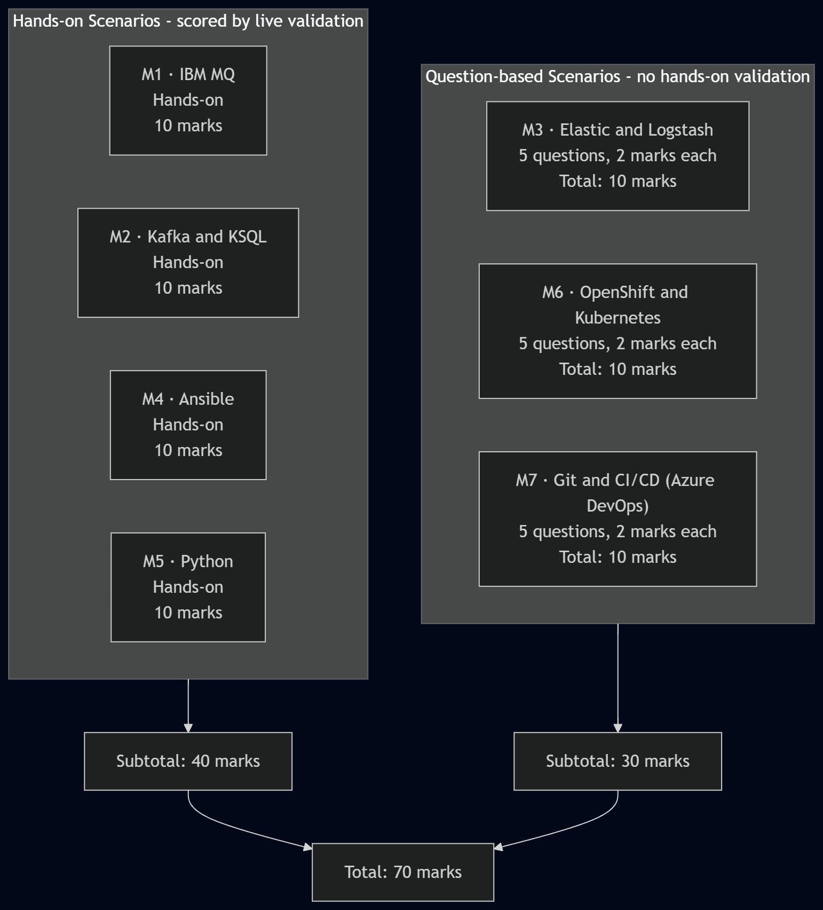

# **Lab Overview**

## **About This Assessment**

This is a hands-on skills assessment for the **Messaging & Eventing - Messaging Operations & Automation** track, built around Nedbank's payments platform. You will work against a single live environment for the full duration, not a simulation - the queue you create, the topic you reconfigure, and the reports you generate are all checked against real, live state.

**Total duration:** 105 minutes
**Total marks:** 70
**Pass threshold:** 70%
**Total scenarios:** 7

## **Overview**

In this assessment you act as the on-call **Messaging/Streaming Engineer** for Nedbank's payments platform. Several operational issues need resolving: a payments queue that doesn't yet exist, a Kafka topic under-provisioned for its throughput target, a consumer group that has silently fallen behind, and no automated way to confirm the platform's health. You will resolve each issue directly against the live environment and are graded on the **state of the live services**, specifically the queue, topic, consumer group, and reports you produce.

## **Environment Architecture**



## **Objectives**

By the end of this assessment you will have:

1. **Provisioned and verified a working queue** on IBM MQ, published as `PAYMENTS.QUEUE` on queue manager `QM1`.
2. **Reconfigured Kafka for its throughput target and resolved a consumer backlog**, against the `orders-events` topic and `orders-consumers` group.
3. **Automated a cross-service health check** covering Kafka and IBM MQ, publishing results to `broker-health.json`.
4. **Built a programmatic lag monitor** for `orders-consumers`, publishing results to `lag-report.json`.
5. **Answered scenario-based questions** covering Elastic and Logstash, OpenShift and Kubernetes, and Git and CI/CD (Azure DevOps).

## **Pre-requisites**

Working knowledge of **IBM MQ** (queue definition, put/get semantics), **Apache Kafka** (topics, partitions, consumer groups, lag), **Ansible** (playbooks, tasks, idempotent checks), and **Python** (scripting against a message broker client library). Comfort working from a Linux shell. No prior Docker experience is required. Where a task involves a containerized service, the scenario gives you the exact command to access it.

## **Scenario Breakdown**

| # | Scenario | Module | Type | Marks |
|---|---|---|---|---|
| 1 | Configure and Verify the Payments Queue | IBM MQ | Hands-on, scored by validation | 10 |
| 2 | Scale Event Throughput & Resolve Consumer Lag | Apache Kafka and KSQL | Hands-on, scored by validation | 10 |
| 3 | Operational Visibility with Elastic and Logstash | Elastic and Logstash | 5 questions, 2 marks each | 10 |
| 4 | Automate Cross-Service Health Verification | Ansible | Hands-on, scored by validation | 10 |
| 5 | Build a Programmatic Lag Monitor | Python | Hands-on, scored by validation | 10 |
| 6 | Running Messaging Workloads on OpenShift and Kubernetes | OpenShift and Kubernetes | 5 questions, 2 marks each | 10 |
| 7 | Shipping Change Through Git and CI/CD | Git and CI/CD (Azure DevOps) | 5 questions, 2 marks each | 10 |

## **Scoring Summary**

- **4 hands-on scenarios** (Scenarios 1, 2, 4, 5) are scored entirely by live validation against the environment - 10 marks each, **40 marks total**.
- **3 question-based scenarios** (Scenarios 3, 6, 7) are scored by inline multiple-choice questions - 5 questions per scenario, 2 marks each, **15 questions and 30 marks total**.
- **40 + 30 = 70 marks**, matching the 105-minute allotted duration.
- Scenarios 1, 2, 4, and 5 also carry additional "Check your understanding" questions - these reinforce the concepts but are **not separately scored**; marks for those scenarios come entirely from the validation.

## **Environment Details**

- **One Ubuntu 22.04 Lab VM** (`Standard_D2s_v3`): **labvm-<inject key="DeploymentID" enableCopy="false"/>**.
- Kafka, Zookeeper, and IBM MQ (`QM1`) run as Docker containers, working directory `/opt/labfiles/stack`. Each scenario that requires you to work inside one of these services gives you the exact login command. You do not need prior Docker experience to complete this assessment.
- Ansible and Python (with `kafka-python`) are installed directly on the host. No container access is needed for those scenarios.
- The `orders-events` topic already exists at 2 partitions, below the 6-partition target, and consumer group `orders-consumers` already has a real backlog seeded against it.
- `PAYMENTS.QUEUE` does not exist yet. Scenario 1 asks you to create it.
- Report output directory: `/opt/labfiles/reports`.
- Your Deployment ID for this run is **<inject key="DeploymentID" enableCopy="false"/>**, quote it if you contact support.

## **Connecting to Your Environment**

Connect to your Lab VM over SSH from your local terminal:

```ssh
ssh azureuser@<inject key="LabVM DNS Name" enableCopy="true"/>
```
You will be prompted for a password:

```text
<inject key="LabVM Admin Password" enableCopy="true"/>
```
You can also find your username and password on the **Environment tab**.

Click **Next** to begin Scenario 1.

Custom handler URL: <inject key="WIZ Portal" enableCopy="true"  /> <br>

Username: <inject key="Username" enableCopy="true"  /> <br>

Password: <inject key="CustomHandlerUserPassword" enableCopy="true" /> <br>  

## Happy Assessing !!
